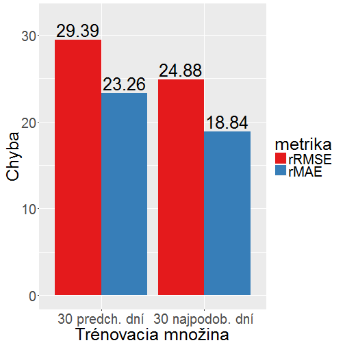

<style>
.notimportant {
  color: 	#909090
}

</style>

PREDIKCIA VÝROBY ELEKTRINY Z OBNOVITEĽNÝCH ZDROJOV SO ZOHĽADNENÍM EXTERNÝCH FAKTOROV
========================================================
author: Oliver Moravčík
date: 14.4.2016
autosize: true
font-family: 'Helvetica'

Prehľad
========================================================
- Cieľ
  - predpovedať produkciu fotovoltaických elektrární na deň dopredu
- Dáta 
  - meteorologické predpovede od SHMÚ, model Aladin 
  - záznamy z produkcie FVE (fotovoltaických elektrární)
  - slnečné koordináty / solárne dáta
  - PostgreSQL
- Model predpovede
  - R
  - random forest

Dáta
========================================================
- formát csv
- Aladin
  - dátum a čas v UTC, hodinové kroky
  - teplota
  - rýchlosť vetra
  - celková oblačnosť (%)
  - relatívna vlhkosť (%)
  - globálne ožiarenie
  - <div class="notimportant">smer vetra</div>
  - <div class="notimportant">atmosferický tlak</div>
  - bodové záznamy => konkrétny bod na časovej osi

========================================================
- FVE
  - dátum a čas v CEST, 15-minutové kroky
  - <div class="notimportant">výkon [kW]</div>
  - energia (práca) [kWh]
  - intervalové záznamy => záznam z 12:00 = 11:45 - 12:00
  - niekoľko chybových záznamov/dní

========================================================
- Slnečné koordináty / solárne dáta:
  - azimut (od východu na západ)
  - elevácia (výška Slnka na oblohe)
  - dĺžka dňa (počet hodín, kedy je Slnko nad horizontom)


```r
library(insol)
library(RPostgreSQL)
all_hours <- seq(ISOdate(2014,7,1,00), 
                 ISOdate(2015,11,1,00),by='hour')
sun_pos <- sunpos(sunvector(JD(all_hours), 
                            lat, long, tmz))
sun_pos <- cbind(sun_pos, 
                 elev = 90 - sun_pos[,'zenith'])
sun_pos <- data.frame(sun_pos, 
                  time = as.character(all_hours))
```

Metriky presnosti
========================================================
- hodnoty nameranej vyprodukovanej energie sú sčítané za celý deň
- odmocnená stredná kvadratická chyba
- predpovedaná hodnota - $y_{i,p}$, skutočná hodnota - $y_{i,s}$ 
- odmocnená stredná kvadratická chyba
$$RMSE=\sqrt{\frac{1}{N}\sum_{i=1}^{N}(y_{i,p} - y_{i,s})^n}$$
- priemerná absolútna chyba
$$MAE=\frac{1}{N}\sum_{i=1}^{N}|y_{i,p} - y_{i,s}|$$

========================================================
- normalizované (%)
$$RRMSE=RMSE*\frac{100}{\frac{1}{N}\sum_{i=1}^{N}y_{i,s}}$$
<br><br>

```r
library(sirad)
statistics <- modeval(predicted, actual, stat=c("RMSE","RRMSE","MAE","RMAE"))
```

Random forest
========================================================
- náhodný les regresných stromov
- každý strom z náhodnej podmnožiny prediktorov
- každý uzol je vytvorený ako najlepšie možné rozdelenie, podľa prediktorov náhodne vybraných pri danom uzle
- výber prediktorov do podmnožín má normálne rozdelenie
- výstup je najpočetnejší hlas (klasifikácia), resp. priemer hlasov (regresia) 


```r
library(randomForest)
forest <- randomForest(data=train_set,
  formula=praca~gho+oblacnost+teplota+dlzkadna)
output <- predict(forest, test_set, type="response", norm.votes=TRUE)
```

Nastavenia modelu
========================================================
- po dnoch: 
  - počet stromov: 700
  - počet uzlov stromu: 2 z 5
  - veľkosť trénovacej množiny: 110

- po hodinách:
  - počet stromov: 500
  - počet uzlov stromu: 2 z 7
  - veľkosť trénovacej množiny: 30
- počet uzlov stromu = odmicnina z počtu prediktorov
  
Výber trénovacej množiny
========================================================
- najpodobnejšie dni
- faktory podobnosti:
  - globálne žiarenie: 90
  - teplota: 10
  - vietor: 1
  
***
- po dňoch:
- po hodinách:

Výsledky
========================================================
left: 60%

***
- červená = RMAE
- modrá = RRMSE

- predch. 30 dní
- žiarenie * 1 
- žiarenie * 90   
`+` teplota * 10   
`+` vietor * 1

Leto vs. zima
========================================================
- leto = 21. marec až 23. september
- zima = 24. september až 20. marec
- 2.4 x viac vyrobenej energie v lete
- 2.34 x menšia RRMSE v lete
- 2.44 x menšia RMAE v lete

========================================================
left: 50%
výroba


***
chybovosť


Zrýchlenie výpočtov v R
========================================================
- alokácia pamäti
- vektorizácia (namiesto cyklov)
- matica namiesto data.frame
- paralelizmus


```r
library(snow)
cl <- makeCluster(4, type='SOCK')
clusterEvalQ(cl, myFun <- function(x) UseMethod("myFun"))
clusterEvalQ(cl, { library(plyr); library(randomForest) })
clusterExport(cl, list("var1", "var2"))
output <- parSapply(cl, vec, function(x) {return(vec + var1 + var2)})
stopCluster(cl)
```

========================================================


***
- a = prvotný kód
- b = alokácia pamäti, vektorizované výpočty, matica namiesto tabuľky
- c = paralelizované

Intel(R) Core(TM) i5-2450M CPU @ 2.50GHz

2 jadrá - 4 thready

