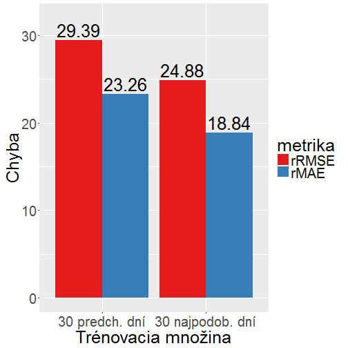
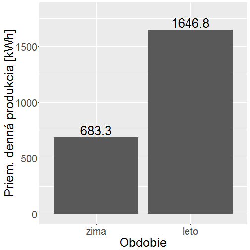
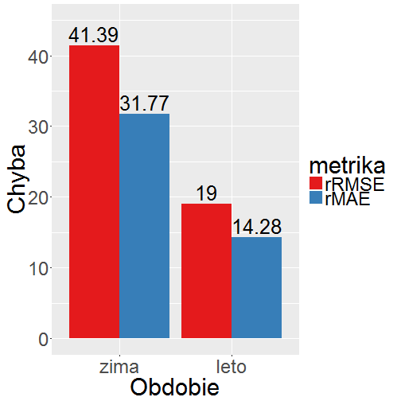
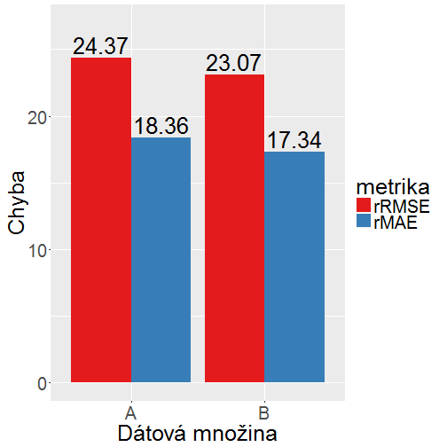
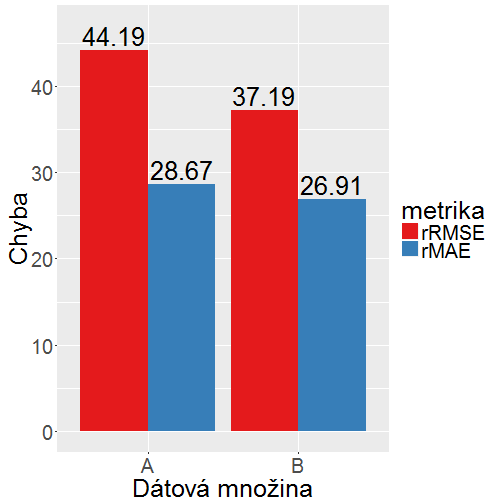
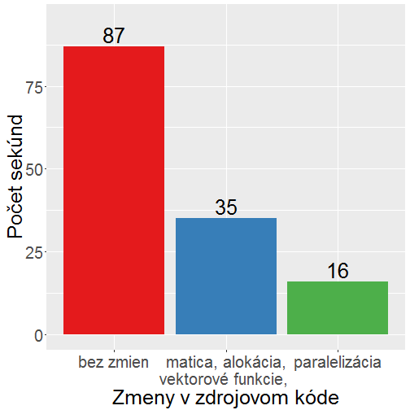

PREDIKCIA VÝROBY ELEKTRINY Z OBNOVITEĽNÝCH ZDROJOV SO ZOHĽADNENÍM EXTERNÝCH FAKTOROV
========================================================
author: Oliver Moravčík
font-family: 'Helvetica'
width: 1152
height: 864
autosize: flase

Prehľad
========================================================
- Cieľ
  - predpovedať produkciu fotovoltaických elektrární na deň dopredu
- Dáta 
  - meteorologické predpovede od SHMÚ, model Aladin 
  - záznamy z produkcie FVE (fotovoltaických elektrární)
  - slnečné koordináty / solárne dáta
- Predikčný model
  - random forest
  - výber trénovacej množiny
- Implementácia
  - PostgreSQL
  - R

Dáta
========================================================
- Aladin
  - model numerickej predpovede počasia
  - 24 hodín dopredu 
  - globálne žiarenie
  - teplota
  - rýchlosť vetra
  - celková oblačnosť (%)
  - relatívna vlhkosť (%)
  
***
- FVE
  - záznamy priebehu produkcie
  - vyprodukovaná energia (práca) [kWh]
  
 
- Slnečné koordináty / solárne dáta:
  - elevácia (výška Slnka na oblohe)
  - dĺžka dňa (dĺžka času, kedy je Slnko v daný deň nad horizontom)

========================================================
- Aladin
  - čas v UTC, hodinové kroky
  - bodové záznamy => konkrétny bod na časovej osi
  
 
- FVE
  - čas v CEST, 15-minutové kroky
  - intervalové záznamy => záznam z 12:00 = 11:45 až 12:00
  - niekoľko chybových záznamov/dní

  
- k predpovedi na 12:00 produkcia od 11:30 do 12:30
  - záznamy z 11:45, 12:00, 12:15 a 12:30

Metriky presnosti
========================================================
- odmocnina zo strednej kvadratickej chyby  
$$ RMSE=\sqrt{\frac{1}{N}\sum_{i=1}^{N}(y_{i,p} - y_{i,s})^n} $$
- priemerná absolútna chyba   
$$ MAE=\frac{1}{N}\sum_{i=1}^{N}|y_{i,p} - y_{i,s}| $$
- normalizované (%)
$$ RRMSE=RMSE*\frac{100}{\frac{1}{N}\sum_{i=1}^{N}y_{i,s}} $$ 

Random forest
========================================================
- náhodný les regresných stromov
- každý strom vytvorený z náhodnej podmnožiny trénovacej množiny
- každý uzol vytvorený podľa náhodne vybraných vstupných premenných 
- výstup je priemer hlasov
- náhodný výber do podmnožín má normálne rozdelenie 
  - môžme sa spoľahnúť na priemer

Nastavenia modelu
========================================================
- veľkosť trénovacej množiny: 30
- počet vytvorených stromov: 500
- počet premenných na vytvorenie uzla: 2 z 7
- minimálna veľkosť listu: 3

- pre každý záznam vytvárame nový les podľa novej vybranej trénovacej množiny
  
Výber trénovacej množiny
========================================================
- najpodobnejšie hodinové záznamy
- záznamy hodnotené výpočtom rozdielnosti
- rozdielnosť vo vstupných premených
  - voči záznamu, pre ktorý predikujeme
  - normalizovaná na škálu (rozsah) hodnôt premennej v dátovej množine
  - násobená faktorom podobnosti danej premennej
  - takto vypočítané rozdielnosti sú sčítané
- faktory podobnosti vyjadrujú dôležitosť (váhu) podobnosti v hodnote danej premennej

========================================================
- $Z$ - záznam, pre ktorý hľadáme najpodobnejšie záznamy
- $P_{i}$ - i-ty záznam z množiny všetkých záznamov $P$
- $S_{GHO}$ - škála globálneho žiarenia: $S_{GHO}=max(P_{GHO})-min(P_{GHO})$
- rozdielnosť i-teho záznamu v globálnom žiarení:
$$ R_{i,GHO}=\frac{|Z_{GHO}-P_{i,GHO}|}{S_{GHO}\times100} $$
- $F_{GHO}$ - faktor podobnosti pre globálne žiarenie
- rozdielnosť i-teho záznamu v globálnom žiarení, teplote a rýchlosti vetra:
$$ R_{i}=(R_{i,GHO}\times F_{GHO})+(R_{i,T}\times F_{T})+(R_{i,RV}\times F_{RV})$$

Výsledky
========================================================
left: 50%

***
Porovnanie: 30 predchádzajúcich / 30 najpodobnejších  
Faktory podobnosti: 
žiarenie = 90  
teplota = 10  
vietor = 1

Faktory podobnosti
========================================================
- GHO = 190
- Celková oblačnosť = 100
- Teplota vzduchu = 30
- Rýchlosť vetra = 5,5
- Relatívna vlhkosť = 1,5
- Dĺžka slnečného svitu = 53
- <strong style="color:black;">Elevácia Slnka na oblohe = 1270</strong>

+ Faktor podobnosti elevácie príliš veľký oproti GHO. 
Aj malý rozdiel v elevácii zapríčiní nevybratie inak 
veľmi podobného záznamy do trénovacej množiny.

***
- GHO = 210
- Celková oblačnosť = 90
- Teplota vzduchu = 7,5
- Rýchlosť vetra = 5,5
- Relatívna vlhkosť = 3,5
- Dĺžka slnečného svitu = 59
- <strong style="color:black;">Elevácia Slnka na oblohe = 41
- q = 6</strong>

+ q - prvotné obmedzenie elevácie +/- 6°

Letná a zimná polovica roka
========================================================
left: 50%
Výroba - priemer na deň

***
Chyba predikcie

========================================================
V zime:
- malé hodnoty žiarenia
- nulové alebo minimálne hodnoty vyprodukovanej energie - zanedbateľné

Obmedzenie dátovej množiny:
- prvá a posledná hodina dňa = východ/západ slnka
- žiarenie < 120 W/m2

množina | dáta      | počet hodín | % hodín | % sum(energia)
--------|-----------|-------------|---------|---------------
    A   | všetky    |      14 117 |  100.00 |    100.00
    B   | obmedzené |       9 368 |   66.36 |     93.23

========================================================
Chyba predikcie v rámci dňa

***
Chyba predikcie v rámci hodiny

Zrýchlenie výpočtov v R
========================================================
- alokácia pamäti (dopredu, nie postupne)
- vektorizácia (namiesto cyklov)
- matica namiesto tabuľky
- paralelizmus (knižnica snow)
- Intel(R) Core(TM) i5-2450M CPU @ 2.50GHz 
2 jadrá - 4 thready

***

Otázky
========================================================
Mohli by ste uviesť, akú dôležitosť získali jednotlivé vstupné atribúty v metóde regresných stromov náhodného lesa?

- priemerné hodnoty dôležitosti 
- celkovo hodnoty ale veľmi rozdielne, od -10 až po 26

množina | žiarenie | oblačnosť | teplota | vietor | vlhkosť | dĺžka dňa | elevácia
--------|----------|-----------|---------|--------|---------|-----------|----------
A       |       2.2|          1|      3.2|       1|      2.4|        3.6|       4.5
B       |       1.4|        1.1|      3.6|     1.4|      2.5|        4.1|       2.8

